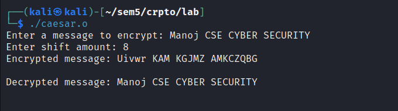

# Ex1-Caesar-Cipher
# AIM:

To encrypt and decrypt the given message by using Ceaser Cipher encryption algorithm.


## DESIGN STEPS:

### Step 1:

Design of Caeser Cipher algorithnm 

### Step 2:

Implementation using C or python language

### Step 3:

1.	In Ceaser Cipher each letter in the plaintext is replaced by a letter some fixed number of positions down the alphabet.
2.	For example, with a left shift of 3, D would be replaced by A, E would become B, and so on.
3.	The encryption can also be represented using modular arithmetic by first transforming the letters into numbers, according to the   
    scheme, A = 0, B = 1, Z = 25.
4.	Encryption of a letter x by a shift key n can be described mathematically as,
                    En(x) = (x + n) mod26
5.	Decryption is performed similarly,
                    Dn (x)=(x - n) mod26


## PROGRAM:
```C
#include <stdio.h>
#include <string.h>

void encrypt(char text[], int shift) {
    for(int i = 0; i < strlen(text); i++) {
        if(text[i] >= 'A' && text[i] <= 'Z') {
            text[i] = (text[i] - 'A' + shift) % 26 + 'A';
        } else if(text[i] >= 'a' && text[i] <= 'z') {
            text[i] = (text[i] - 'a' + shift) % 26 + 'a';
        }
    }
}

void decrypt(char text[], int shift) {
    encrypt(text, 26 - shift); // Just reverse the encryption process
}

int main() {
    char text[100];
    int shift;

    printf("Enter a message to encrypt: ");
    fgets(text, sizeof(text), stdin); // Use fgets to read string with spaces

    printf("Enter shift amount: ");
    scanf("%d", &shift);

    encrypt(text, shift);
    printf("Encrypted message: %s\n", text);

    decrypt(text, shift);
    printf("Decrypted message: %s\n", text);

    return 0;
}
```

## OUTPUT:


## RESULT:
    
    Thus the caesar cipher Encryption and Decryption using C program successfully executed .